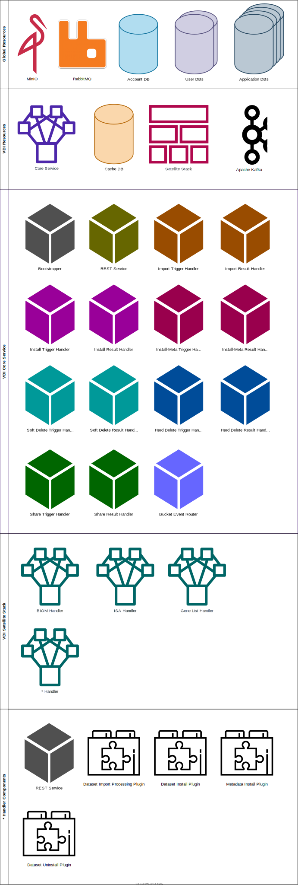
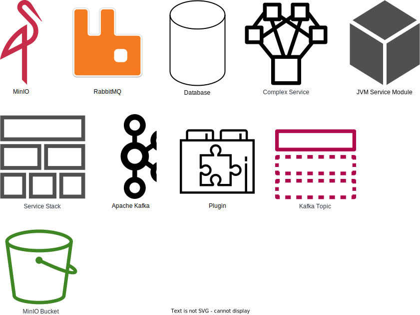
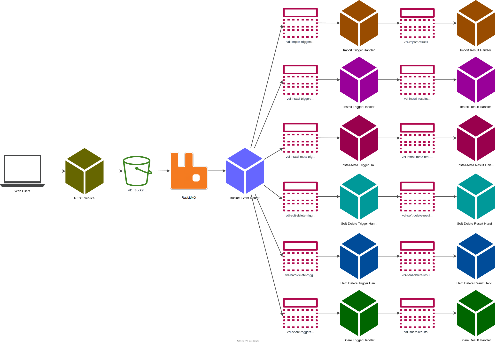
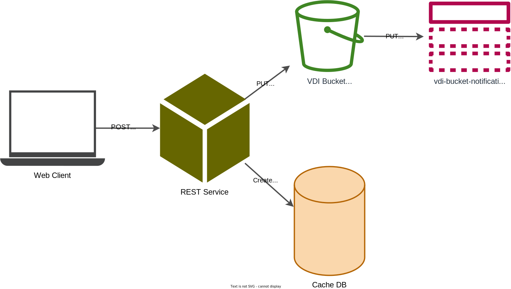

= VDI Design
:icons: font
:toc: left

== Components

.Legend
--

--

== Workflow

=== REST API Actions

==== List Datasets for User

link:https://veupathdb.github.io/vdi-service/vdi-api.html#resources:/vdi-datasets:get[API Docs]

. Client makes a `GET` request to the dataset list endpoint.
. REST service queries the Cache DB for datasets belonging to or shared with the
  requesting user (by WDK user ID)
. REST service returns the list to the client.

==== Lookup Dataset

link:https://veupathdb.github.io/vdi-service/vdi-api.html#resources:/vdi-datasets/\{vd-id}:get[API Docs]

==== Create Dataset

link:https://veupathdb.github.io/vdi-service/vdi-api.html#resources:/vdi-datasets:post[API Docs]

. Client ``POST``s a dataset and accompanying metadata to the VDI REST API.
. REST Service sanity-checks the dataset metadata.
. REST Service generates a VDI ID for the dataset.
. REST Service writes records into the cache DB for the dataset.
** dataset details
** dataset metadata
** dataset import status
** dataset project links
. REST service ``PUT``s the dataset data into the VDI MinIO bucket.
. MinIO emits an event for the ``PUT`` to the appropriate Kafka topic.

==== Update Dataset Metadata

link:https://veupathdb.github.io/vdi-service/vdi-api.html#resources:/vdi-datasets/\{vd-id}:patch[API Docs]

. Client submits ``PATCH`` request with updates to the dataset's metadata.
. REST Service sanity checks the dataset metadata.
. REST Service updates the metadata in the Cache DB
. REST Service ``PUT``s the updated metadata into the VDI Bucket (MinIO)
. MinIO emits an event for the ``PUT`` to the appropriate Kafka topic

==== Delete Dataset

image::assets/vdi-user-action-delete.svg[]

link:https://veupathdb.github.io/vdi-service/vdi-api.html#resources:/vdi-datasets/\{vd-id}:delete[API Docs]

. Client submits ``DELETE`` request to the target dataset.
. REST service validates that the requesting user owns the target dataset.
. REST service updates the dataset record in the Cache DB, marking it as
  "deleted"
. REST service ``PUT``s a delete marker flag in the dataset "directory" in the
  VDI Bucket (MinIO).
. MinIO emits an event for the object `PUT` to the global RabbitMQ.

==== Offer Dataset Share

link:https://veupathdb.github.io/vdi-service/vdi-api.html#resources:/vdi-datasets/\{vd-id}/shares/\{recipient-user-id}/offer:put[API Docs]

. Client makes a `PUT` request with the share action `"grant"`.
. REST Service validates target user exists.
. REST Service updates or inserts the target share record in the Cache DB.
. REST Service ``PUT``s a new share offer object into MinIO.
. MinIO emits an event for the object `PUT` to the global RabbitMQ.

==== Revoke Dataset Share Offer

image::assets/vdi-user-action-share-revoke.svg[]

link:https://veupathdb.github.io/vdi-service/vdi-api.html#resources:/vdi-datasets/\{vd-id}/shares/\{recipient-user-id}/offer:put[API Docs]

. Client makes `PUT` request with the share action `"revoke"`.
. REST Service validates target user exists.
. REST Service updates or inserts the target share record in the Cache DB.
. REST Service ``PUT``s a new share offer object into MinIO
. MinIO emits an event for the object `PUT` to the global RabbitMQ.

==== Accept Dataset Share Offer

image::assets/vdi-user-action-share-accept.svg[]

==== Reject Dataset Share Offer

==== Reconciliation

==== Failed Dataset Install Cleanup

==== Deleted Dataset Cleanup

=== Internal Actions

==== Import Dataset

==== Install Dataset

==== Update Dataset Metadata

==== Soft Delete Dataset

==== Hard Delete Dataset

== Resources

=== Global Resources

==== MinIO

VDI uses a single bucket (object container) with object keys structured as if
they were filesystem paths to the target objects.  With these key/paths we
create conceptual "directories" to "contain" the dataset files.

The structure of the paths is as follows:

[source, directory-tree]
----
bucket/
  |- {owner-user-id}/
  |    |- {dataset-id}/
  |    |    |- data/
  |    |    |    |- some-data-file-1.tsv
  |    |    |    |- some-data-file-2.tsv
  |    |    |- shares/
  |    |    |    |- {recipient-user-id}/
  |    |    |    |    |- offer.json
  |    |    |    |    |- receipt.json
  |    |    |- upload/
  |    |    |    |- uploaded-dataset-file-1.png
  |    |    |    |- uploaded-dataset-file-2.xml
  |    |    |- delete-flag
  |    |    |- manifest.json
  |    |    |- meta.json
----

With this structure it is easy to reason about and crawl the contents of the
VDI bucket

==== Rabbit MQ

VDI uses RabbitMQ to listen for event messages coming from <<MinIO>> that
represent object creations and deletions within the VDI MinIO bucket.  Every
time an object is put into the bucket or deleted from the bucket an event
message is sent through RabbitMQ.

==== Oracle Account DB

==== Oracle User DB(s)

==== Oracle Application DBs

=== Project Resources

==== Apache Kafka

==== Cache DB

== Database Schemata

=== Internal Cache DB

==== `vdi.datasets`

[%header, cols="3m,1m,6"]
|===
| Column       | Type      | Comment
| dataset_id   | CHAR(32)  |
| type_name    | VARCHAR   | Name of the dataset type.
| type_version | VARCHAR   | Version for the dataset type.
| owner_id     | VARCHAR   | User ID of the owner of the dataset.  WDK user IDs will be `long` values.
| is_deleted   | BOOLEAN   | Soft delete marker.
| created      | TIMESTAMP |
|===

==== `vdi.dataset_files`

[%header, cols="3m,1m,6"]
|===
| Column     | Type     | Comment
| dataset_id | CHAR(32) |
| file_name  | VARCHAR  |
|===

==== `vdi.dataset_projects`

[%header, cols="3m,1m,6"]
|===
| Column     | Type     | Comment
| dataset_id | CHAR(32) |
| project_id | VARCHAR  |
|===

==== `vdi.dataset_metadata`

[%header, cols="3m,1m,6"]
|===
| Column      | Type     | Comment
| dataset_id  | CHAR(32) |
| name        | VARCHAR  | Name of the dataset.
| summary     | VARCHAR  | Optional summary for the dataset.
| description | VARCHAR  | Optional description of the dataset.
|===

==== `vdi.sync_control`

[%header, cols="3m,1m,6"]
|===
| Column             | Type      | Comment
| dataset_id         | CHAR(32)  |
| shares_update_time | TIMESTAMP | Timestamp of the most recent share file across all shares.
| data_update_time   | TIMESTAMP | Timestamp of the most recent data file
| meta_update_time   | TIMESTAMP | Timestamp of the meta file
|===

==== `vdi.dataset_share_offers`

[%header, cols="3m,1m,6"]
|===
| Column             | Type      | Comment
| dataset_id         | CHAR(32)  |
| recipient_id       | VARCHAR   | ID of the recipient of the share offer.
| status             | VARCHAR   | `"grant" \| "revoke"`
|===

==== `vdi.dataset_share_receipts`

[%header, cols="3m,1m,6"]
|===
| Column             | Type      | Comment
| dataset_id         | CHAR(32)  |
| recipient_id       | VARCHAR   | ID of the recipient of the share offer.
| status             | VARCHAR   | `"accept" \| "reject"`
|===

==== `vdi.import_control`

[%header, cols="3m,1m,6"]
|===
| Column             | Type      | Comment
| dataset_id         | CHAR(32)  |
| status             | VARCHAR   | `"awaiting_import" \| "importing" \| "imported" \| "failed"`
|===

=== Application DBs

== Message Queues & Topics

=== Global RabbitMQ

==== `vdi-bucket-notifications`

The `vdi-bucket-notifications` RabbitMQ queue is fed by events coming directly
from <<MinIO>> for every object that is put into the target VDI bucket or
deleted from the target VDI bucket.

.Example Object Put Event Body
[source, json]
----
{
  "EventName": "s3:ObjectCreated:Put",
  "Key": "some-other-bucket/minio.png",
  "Records": [
    {
      "eventVersion": "2.0",
      "eventSource": "minio:s3",
      "awsRegion": "",
      "eventTime": "2023-02-28T12:46:17.934Z",
      "eventName": "s3:ObjectCreated:Put",
      "userIdentity": {
        "principalId": "someToken"
      },
      "requestParameters": {
        "principalId": "someToken",
        "region": "",
        "sourceIPAddress": "127.0.0.1"
      },
      "responseElements": {
        "content-length": "0",
        "x-amz-request-id": "1747FDBDD1E65B89",
        "x-minio-deployment-id": "f143f7ea-b0c8-4c67-bd9d-452d1ec89cca",
        "x-minio-origin-endpoint": "http://172.24.0.5:9000"
      },
      "s3": {
        "s3SchemaVersion": "1.0",
        "configurationId": "Config",
        "bucket": {
          "name": "some-other-bucket",
          "ownerIdentity": {
            "principalId": "someToken"
          },
          "arn": "arn:aws:s3:::some-other-bucket"
        },
        "object": {
          "key": "minio.png",
          "size": 8114,
          "eTag": "ac052a420b148a7c055767538445f544",
          "contentType": "image/png",
          "userMetadata": {
            "content-type": "image/png"
          },
          "sequencer": "1747FDBDD219CAE5"
        }
      },
      "source": {
        "host": "127.0.0.1",
        "port": "",
        "userAgent": "MinIO (linux; amd64) minio-go/v7.0.47 MinIO Console/(dev)"
      }
    }
  ]
}
----

.Example Object Delete Event Body
[source, json]
----
{
  "EventName": "s3:ObjectRemoved:Delete",
  "Key": "some-other-bucket/minio.png",
  "Records": [
    {
      "eventVersion": "2.0",
      "eventSource": "minio:s3",
      "awsRegion": "",
      "eventTime": "2023-02-28T12:53:38.154Z",
      "eventName": "s3:ObjectRemoved:Delete",
      "userIdentity": {
        "principalId": "someToken"
      },
      "requestParameters": {
        "principalId": "someToken",
        "region": "",
        "sourceIPAddress": "127.0.0.1"
      },
      "responseElements": {
        "content-length": "155",
        "x-amz-request-id": "1747FE245132AF61",
        "x-minio-deployment-id": "f143f7ea-b0c8-4c67-bd9d-452d1ec89cca",
        "x-minio-origin-endpoint": "http://172.24.0.5:9000"
      },
      "s3": {
        "s3SchemaVersion": "1.0",
        "configurationId": "Config",
        "bucket": {
          "name": "some-other-bucket",
          "ownerIdentity": {
            "principalId": "someToken"
          },
          "arn": "arn:aws:s3:::some-other-bucket"
        },
        "object": {
          "key": "minio.png",
          "sequencer": "1747FE2451444D88"
        }
      },
      "source": {
        "host": "127.0.0.1",
        "port": "",
        "userAgent": "MinIO (linux; amd64) minio-go/v7.0.47 MinIO Console/(dev)"
      }
    }
  ]
}
----

=== Stack-Internal Kafka

==== `vdi-import-triggers`

.Message Body Schema
[source, protobuf]
----
message ImportTrigger {
  required string datasetID = 1;
  required string userID = 2;
}
----

.Example Message Body
[source, json]
----
{
  "datasetID": "bd77e09020a76cb244647ffaa2458bed",
  "userID": "123456789"
}
----

==== `vdi-import-results`

==== `vdi-install-triggers`

==== `vdi-install-results`

==== `vdi-install-meta-triggers`

.Message Body Schema
[source, protobuf]
----
message InstallMetaTrigger {
  required string datasetID = 1;
  required string userID = 2;
}
----

.Example Message Body
[source, json]
----
{
  "datasetID": "bd77e09020a76cb244647ffaa2458bed",
  "userID": "123456789"
}
----

==== `vdi-install-meta-results`

==== `vdi-soft-delete-triggers`

.Message Body Schema
[source, protobuf]
----
message SoftDeleteTrigger {
  required string datasetID = 1;
  required string userID = 2;
}
----

.Example Message Body
[source, json]
----
{
  "datasetID": "bd77e09020a76cb244647ffaa2458bed",
  "userID": "123456789"
}
----

==== `vdi-soft-delete-results`

==== `vdi-hard-delete-triggers`

==== `vdi-hard-delete-results`

==== `vdi-share-triggers`

==== `vdi-share-results`

